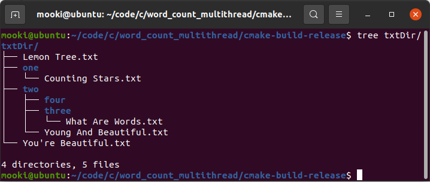

# Word Count Based On Multithread

##### 一个基于多线程的词频统计工具

###### GitHub: https://github.com/mookixiao/word_count_multithread

## 一、设计要点

1. 通过哈希表完成对特定哈希值单词的索引
2. 使用一个结构体表示特定单词，包括指针、计数、锁等
3. 使用互斥锁作用于两处，分别实现对哈希表、单词节点的保护
4. 哈希函数采用广泛使用的DJBHash算法
5. 递归遍历目标文件夹，同时将找到的文件分发到新建线程进行处理

## 二、预设参数

```c
#define THREADNUMMAX 1024  // 最多同时处理1024个文件
#define MOD 10007  // hash值计算模数
#define WORDLENMAX 128  // 单词最大长度
```

## 三、主要数据结构

1. 单词节点

   ```c
   // 单词节点
   typedef struct WordNodeTag{
       char *word;
       struct WordNodeTag *next;
       uint32_t num;
       pthread_mutex_t mtx;
   }WordNode;
   ```

2. 哈希表

   ```c
   struct {
       WordNode *wordNodeP;
       pthread_mutex_t mtx;
   } wordNodeHashTab[MOD];
   ```

## 四、工作流程

1. 使用递归的方法遍历传入路径的目录树，并将找到的文本文件分发给新开线程（见图1）
2. 从文本文件中拆分出一个个独立单词（见图2）
3. 为每个单词计算哈希值，完成对哈希表的索引，并在互斥锁的保护下更新相关数据结构（见图3）
4. 等待所有子线程处理完成
6. 遍历哈希表输出结果


## 五、构建说明

1. 典型流程

   ```shell
   git clone https://github.com/mookixiao/word_count_multithread.git
   
   cd word_count_multithread
   
   mkdir build
   
   cd build
   
   cmake ..
   
   cmake --build .
   ```

2. 最终得到`word_count_mt`可执行文件

## 六、效果截图

1. 先使用`tree`命令观察要计数的文件所在目录树

   
   
2. 使用`./word_count_mt txtDir`对目录下的文件进行单词计数

   

3. 如果输入的路径名不是文件夹，则报错

   

## 七、参考资料

1. 《算法笔记》
2. 《UNIX环境高级编程 第3版》
3. 《C和指针》
4. 《数据结构与算法分析 第2版》